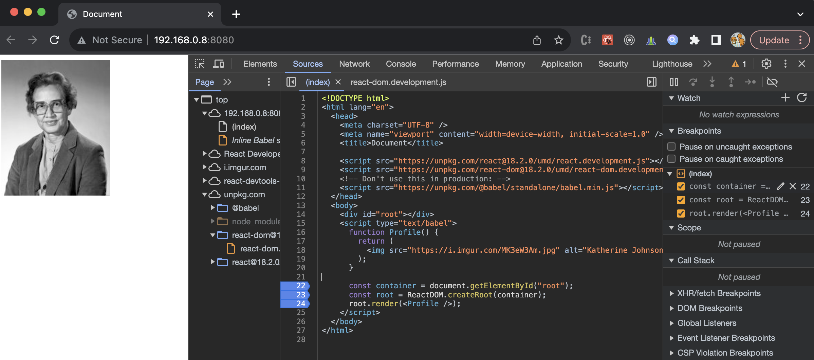
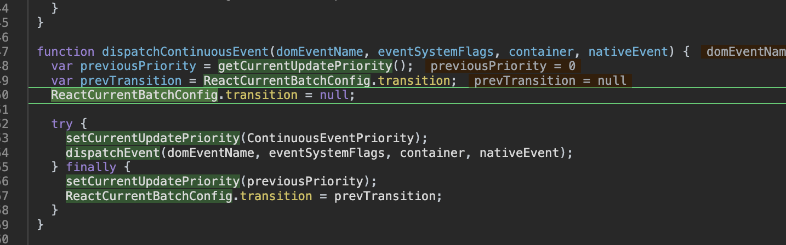
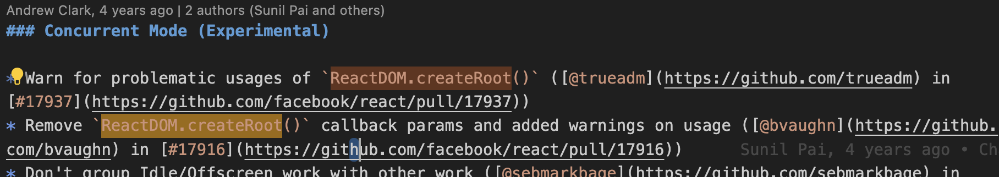

- https://react.dev/learn/your-first-component#defining-a-component

- 리액트 사용 코드 출처

  - https://react.dev/learn/installation#try-react-locally

- 흠.. 어디를 중단점으로 잡아야 할 지를 모르겠다



- 그래서 22,23,24 line 다 잡고 진행

- 22 라인은

```
const container = document.getElementById('root')
```

즉, JavaScript DOM API를 사용

- 23, 24 line에 두고 진행

  - 그러다가 23 라인에만 두고 그대로 디버깅해보니, 같은 곳에 멈춤



- 단, 10줄

line 6448

```js
// const container = ReactDOM.createRoot(container);

var previousPriority = getCurrentUpdatePriority();
```

- 왜 저 호출에서 이렇게 넘어간거지?

```js
// 29858 line
exports.createRoot = createRoot$1;
```

- createRoot$1을 찾아보자

  - 왜 뒤에 $1 네이밍을 붙이는 거지?

```js
function createRoot$1(container, options) {
  {
    if (!Internals.usingClientEntryPoint && !true) {
      error(
        'You are importing createRoot from "react-dom" which is not supported. ' +
          'You should instead import it from "react-dom/client".'
      );
    }
  }

  return createRoot(container, options);
}
```

//line 9353

- 그 후, function createRoot를 찾았음

```js
if (!isValidContainer(container)) {
  throw new Error("createRoot(...): Target container is not a DOM element.");
}
```

- Container가 유효한지 검사

- 어떻게 Container가 유효한지 검사?

  - isValidContainer

```js
function createRoot(container, options) {
  if (!isValidContainer(container)) {
    throw new Error("createRoot(...): Target container is not a DOM element.");
  }

  warnIfReactDOMContainerInDEV(container);
  var isStrictMode = false;
  var concurrentUpdatesByDefaultOverride = false;
  var identifierPrefix = "";
  var onRecoverableError = defaultOnRecoverableError;
  var transitionCallbacks = null;

  if (options !== null && options !== undefined) {
    {
      if (options.hydrate) {
        warn(
          "hydrate through createRoot is deprecated. Use ReactDOMClient.hydrateRoot(container, <App />) instead."
        );
      } else {
        if (
          typeof options === "object" &&
          options !== null &&
          options.$$typeof === REACT_ELEMENT_TYPE
        ) {
          error(
            "You passed a JSX element to createRoot. You probably meant to " +
              "call root.render instead. " +
              "Example usage:\n\n" +
              "  let root = createRoot(domContainer);\n" +
              "  root.render(<App />);"
          );
        }
      }
    }

    if (options.unstable_strictMode === true) {
      isStrictMode = true;
    }

    if (options.identifierPrefix !== undefined) {
      identifierPrefix = options.identifierPrefix;
    }

    if (options.onRecoverableError !== undefined) {
      onRecoverableError = options.onRecoverableError;
    }

    if (options.transitionCallbacks !== undefined) {
      transitionCallbacks = options.transitionCallbacks;
    }
  }

  var root = createContainer(
    container,
    ConcurrentRoot,
    null,
    isStrictMode,
    concurrentUpdatesByDefaultOverride,
    identifierPrefix,
    onRecoverableError
  );
  markContainerAsRoot(root.current, container);
  var rootContainerElement =
    container.nodeType === COMMENT_NODE ? container.parentNode : container;
  listenToAllSupportedEvents(rootContainerElement);
  return new ReactDOMRoot(root);
}
```

- ReactDOM.createRoot가 이제는 지원하지 않는다고 하던데?



- import 문에서는 react-dom/client, umd에서는 ReactDOM으로 표시해서 사용한다??? 